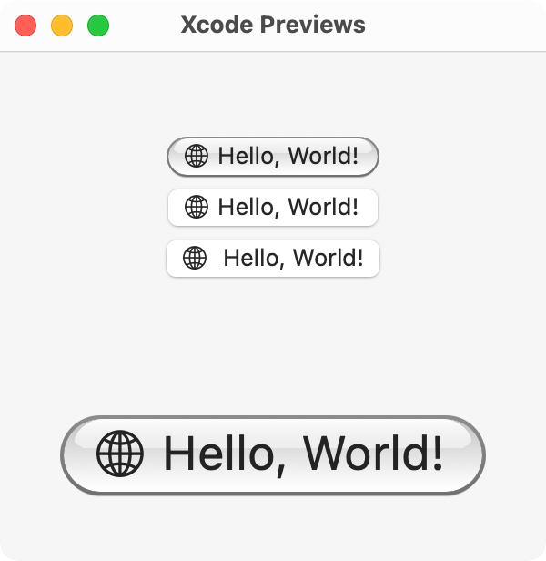

Hydrobolic
==========

Aqua-inspired UI components for AppKit. Written in Swift.

Goals
-----

* Utilize subclassing as much as possible for greater accessibility
* Draw all controls programmatically; avoid image assets at all costs
* Support dark appearance & tint colors (graphite included) transparently
* Forward-compatible with Liquid Glass but nicer

Naming
------

**hydro-bòlic** *(adj.)*

: of, relating to, or being like a liquid glass

1. **Bò-li**: “glass” in Taiwanese Hakka, [Hoiliug dialect](https://en.wikipedia.org/wiki/Hailu_dialect).
2. **hydro-**: of water and liquid.
3. **-bolic**: to cast.

License
-------

Currently [LGPLv3](https://www.gnu.org/licenses/lgpl-3.0.html). Might relicense later.

