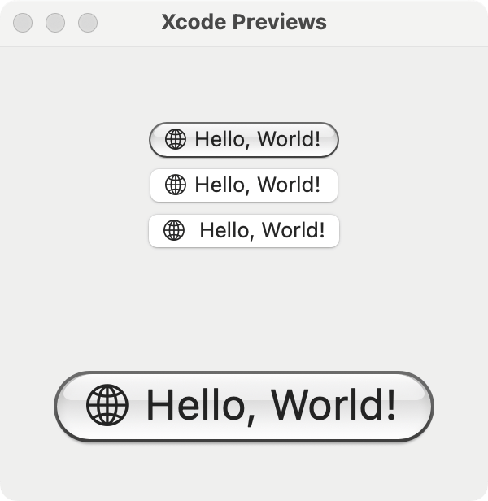

Hydrobolic
==========

Aqua-inspired UI components for AppKit. Written in Swift.

This project wouldn’t be possible without the inspirations from [Kyle Halevi](https://mastodon.design/@kylehalevi/109436255622536340)’s Sketch recreation and [Jon Sterling](https://github.com/jonsterling/AquaUI)’s SwiftUI implementation.

Goals
-----

- [x] Utilize subclassing as much as possible for greater accessibility
- [x] Draw all controls programmatically; avoid image assets at all costs
- [ ] Support dark appearance & tint colors (graphite included) transparently
- [ ] Forward-compatible with Liquid Glass but nicer

Naming
------

**hydro-bòlic** *(adj.)*

: of, relating to, or being like a liquid glass

1. **Bò-li**: “glass” in Taiwanese Hakka, [Hoiliug dialect](https://en.wikipedia.org/wiki/Hailu_dialect).
2. **hydro-**: of water and liquid.
3. **-bolic**: to cast.

License
-------

Hyperbolic © 2025 Poren Chiang (@RSChiang), released under [LGPLv3](https://www.gnu.org/licenses/lgpl-3.0.html).
